# Bookilot — Architecture Diagrams

## System Architecture Overview

```mermaid
graph TB
    subgraph "Client Layer"
        Owner["👤 Business Owner<br/>Browser"]
        Customer["🛒 Customer<br/>Browser"]
        Staff["👨‍💼 Staff Member<br/>Browser"]
        Embed["📦 Embeddable Widget<br/>iframe on Business Website"]
    end

    subgraph "Frontend (Next.js 15 App Router)"
        Landing["Landing Page<br/>/"]
        Pricing["Pricing Page<br/>/pricing"]
        Auth["Auth Pages<br/>/login, /register"]
        Dashboard["Dashboard<br/>/dashboard"]
        Services["Services<br/>/services"]
        Bookings["Bookings<br/>/bookings"]
        StaffPage["Staff<br/>/staff"]
        Customers["Customers<br/>/customers"]
        Settings["Settings<br/>/settings"]
        Billing["Billing<br/>/billing"]
        Onboarding["Onboarding<br/>/onboarding"]
        Widget["Booking Widget<br/>/widget?orgId=X"]
        Manage["Booking Management<br/>/bookings/manage/:token"]
    end

    subgraph "API Layer (Next.js API Routes)"
        AuthAPI["/api/auth/*<br/>AuthJS Handler"]
        BookingsAPI["/api/bookings<br/>CRUD + Cancel"]
        ServicesAPI["/api/services<br/>CRUD"]
        StaffAPI["/api/staff<br/>CRUD"]
        CustomersAPI["/api/customers<br/>List"]
        AvailabilityAPI["/api/availability<br/>Slot Calculation"]
        WidgetAPI["/api/widget/services<br/>Public Services"]
        SettingsAPI["/api/settings<br/>Org + Hours"]
        DashboardAPI["/api/dashboard<br/>Stats + Today"]
        BillingAPI["/api/billing<br/>Plan + Usage"]
        OnboardingAPI["/api/onboarding/complete<br/>Setup"]
        WebhooksAPI["/api/webhooks/paystack<br/>Payment Events"]
        InngestAPI["/api/inngest<br/>Background Jobs"]
    end

    subgraph "Service Layer (Business Logic)"
        BookingService["booking.service.ts<br/>createBooking, cancelBooking,<br/>completeBooking, markNoShow"]
        AvailabilityService["availability.service.ts<br/>computeAvailableSlots,<br/>getRecommendedSlots"]
    end

    subgraph "Data Layer"
        Drizzle["Drizzle ORM<br/>Query Builder"]
        Neon[("Neon PostgreSQL<br/>14 Tables<br/>Serverless Postgres")]
    end

    subgraph "Third-Party Services"
        Twilio["📱 Twilio<br/>SMS Gateway"]
        Nodemailer["📧 Nodemailer<br/>Gmail SMTP"]
        Inngest["⚡ Inngest<br/>Background Jobs"]
        Paystack["💳 Paystack<br/>Payments"]
        GoogleOAuth["🔐 Google OAuth<br/>SSO"]
    end

    subgraph "Background Workers"
        ReminderWorker["⏰ send-reminder<br/>24h before appointment"]
        NoShowWorker["🚫 handle-no-shows<br/>Cron every 15min"]
    end

    subgraph "Middleware"
        MW["Auth Middleware<br/>Status-based routing"]
    end

    Owner --> Dashboard
    Owner --> Services
    Owner --> Bookings
    Owner --> StaffPage
    Owner --> Customers
    Owner --> Settings
    Owner --> Billing
    Staff --> Dashboard
    Staff --> Bookings
    Customer --> Widget
    Customer --> Manage
    Embed --> Widget

    Dashboard --> MW
    Services --> MW
    Bookings --> MW
    StaffPage --> MW
    Settings --> MW
    Billing --> MW

    MW --> AuthAPI
    Dashboard --> DashboardAPI
    Services --> ServicesAPI
    Bookings --> BookingsAPI
    StaffPage --> StaffAPI
    Customers --> CustomersAPI
    Settings --> SettingsAPI
    Billing --> BillingAPI
    Widget --> AvailabilityAPI
    Widget --> WidgetAPI
    Widget --> BookingsAPI

    BookingsAPI --> BookingService
    AvailabilityAPI --> AvailabilityService

    BookingService --> Drizzle
    AvailabilityService --> Drizzle
    Drizzle --> Neon

    BookingsAPI -->|"fire event"| Inngest
    Inngest --> ReminderWorker
    Inngest --> NoShowWorker
    ReminderWorker --> Twilio
    ReminderWorker --> Nodemailer

    BookingsAPI -->|"SMS confirm"| Twilio
    BookingsAPI -->|"Email confirm"| Nodemailer
    AuthAPI --> GoogleOAuth
    BillingAPI --> Paystack
    WebhooksAPI --> Paystack
```

---

## Authentication Flow

### Registration → Verification → Onboarding

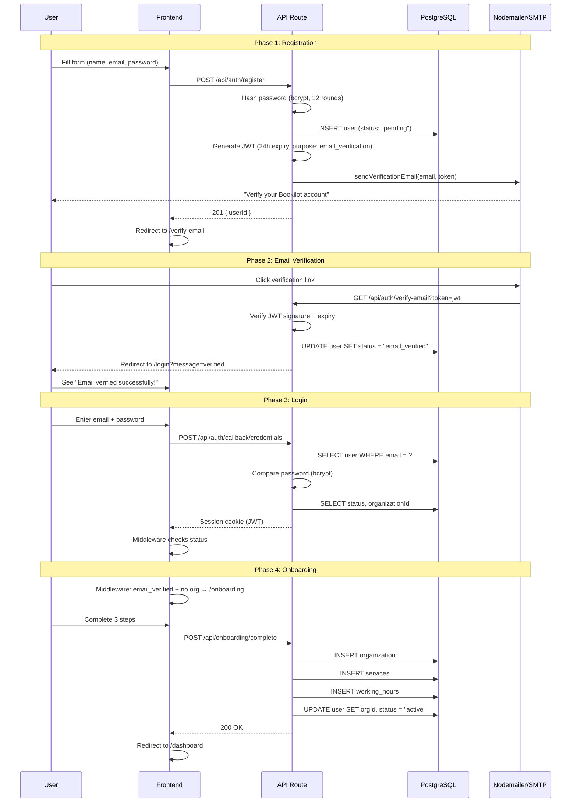

### Google OAuth Flow

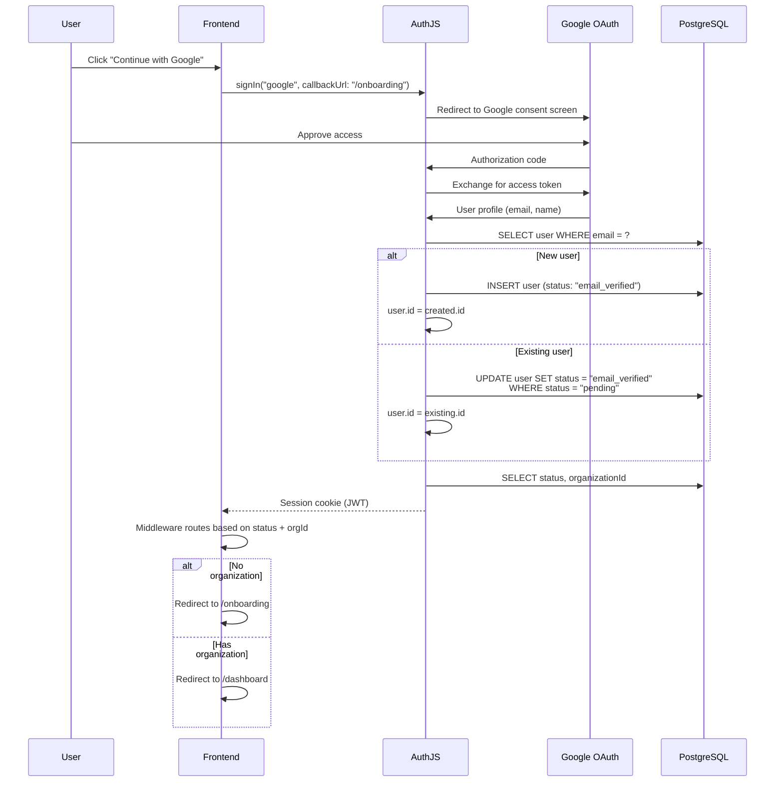

---

## Booking Flow (Customer)

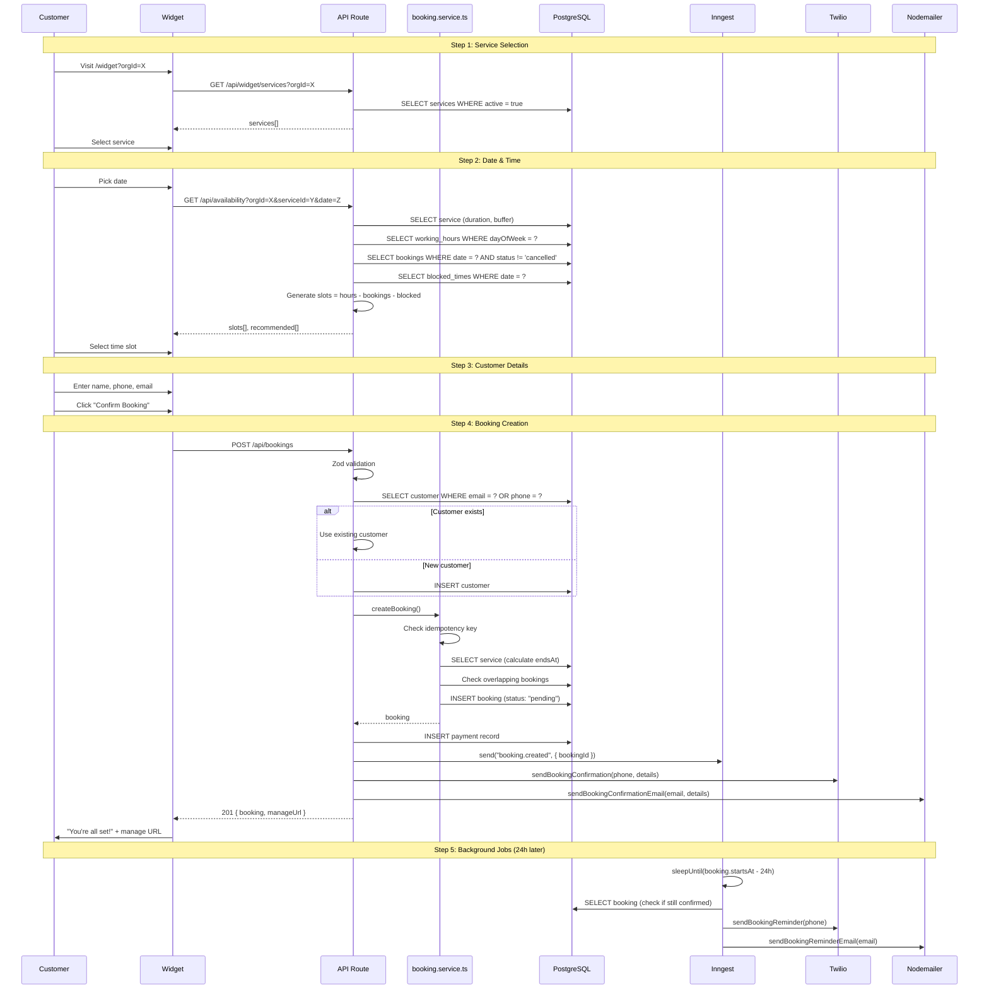

---

## Availability Calculation Flow

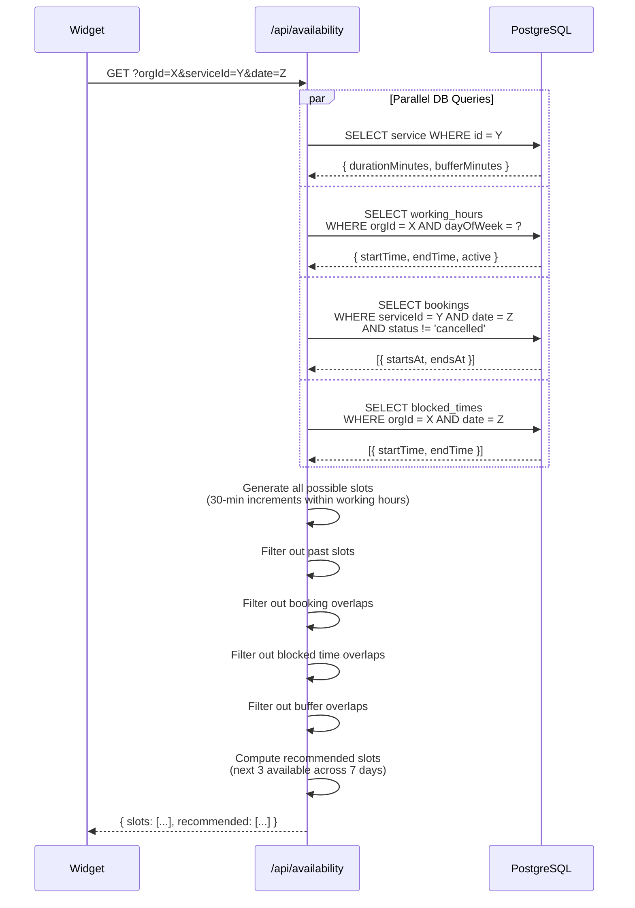

---

## Settings Update Flow

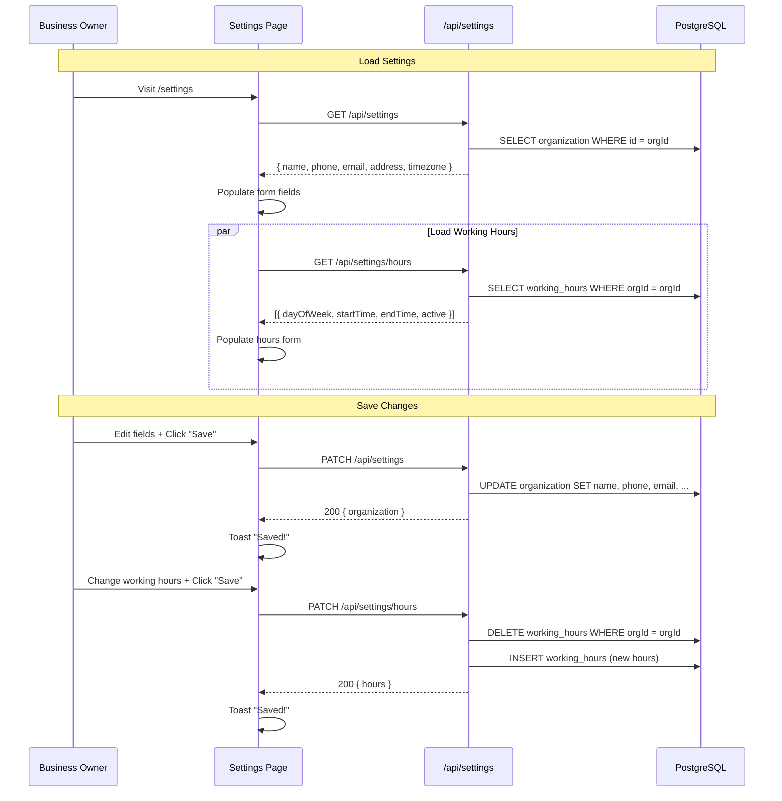

---

## Staff Management Flow

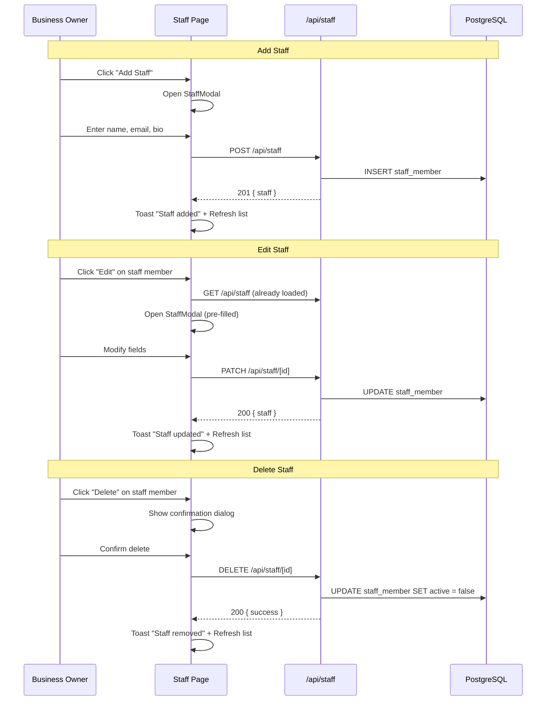

---

## Payment Flow (Paystack)

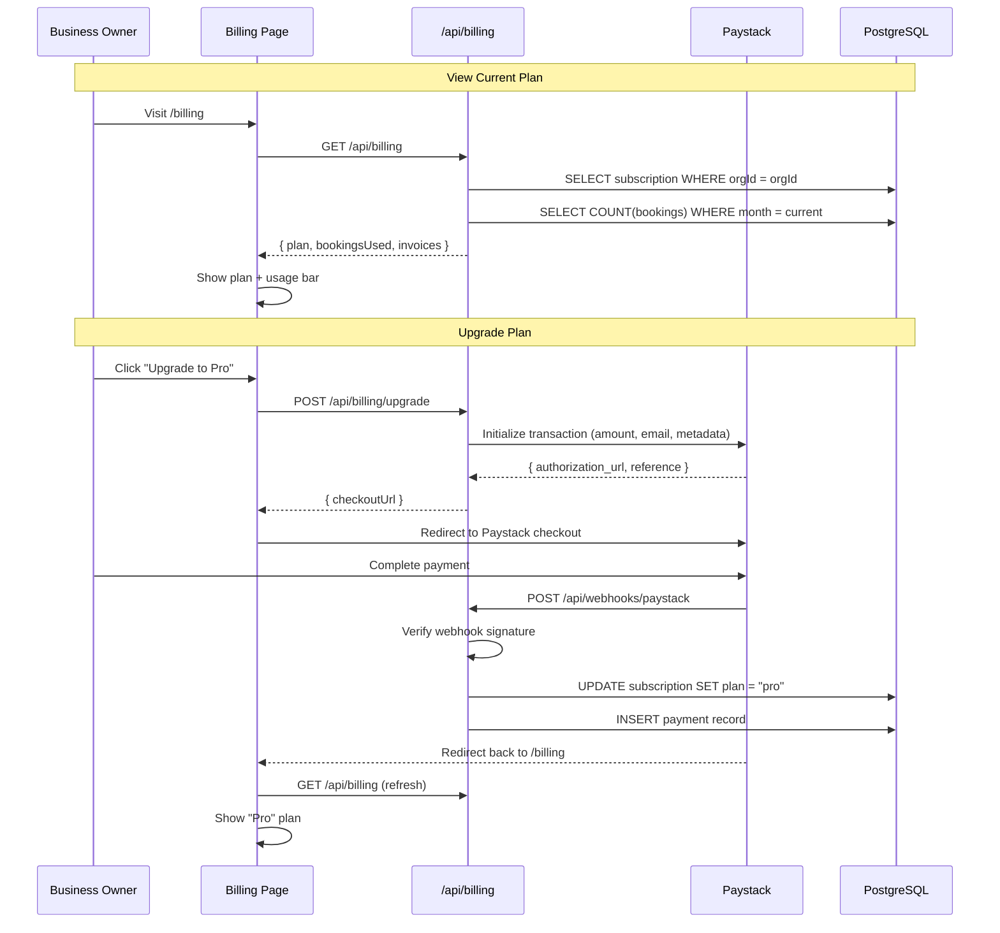

---

## Background Jobs Flow

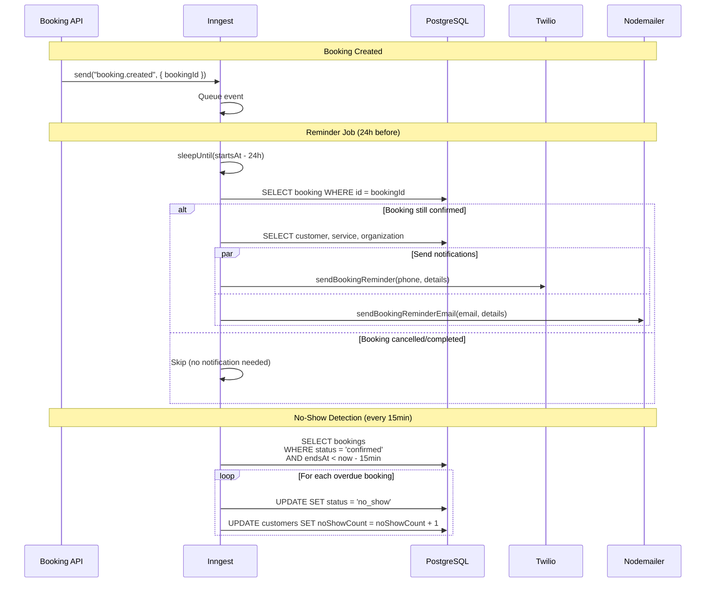

---

## Multi-Tenancy Data Flow

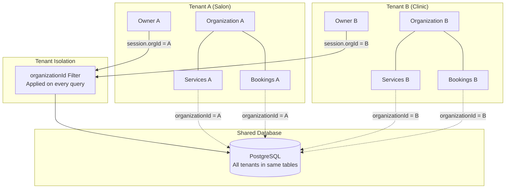

---

## External Communication Map

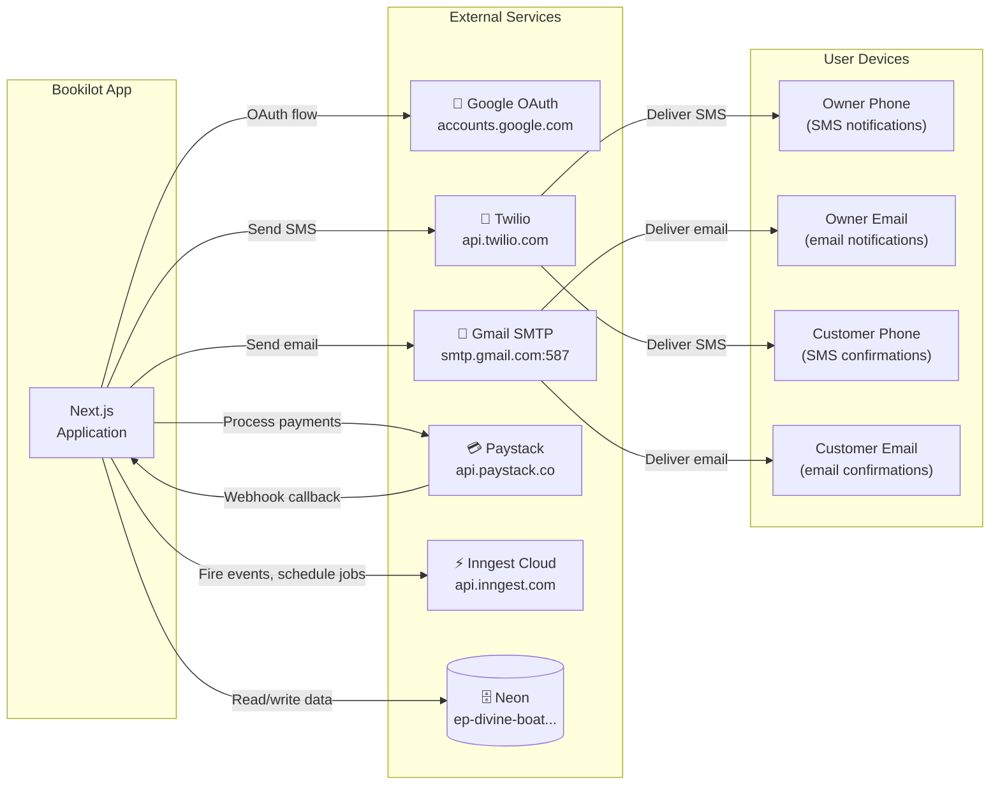

---

## Middleware Routing Logic

```mermaid
flowchart TD
    Start([Request]) --> IsPublic{Is public route?<br/>/, /login, /register,<br/>/pricing, /widget/*,<br/>/api/auth/*}
    IsPublic -->|Yes| Allow([NextResponse.next])
    IsPublic -->|No| HasAuth{Has session?}

    HasAuth -->|No| ToLogin[Redirect to /login]
    HasAuth -->|Yes| GetStatus[Get status from session]

    GetStatus --> IsPending{status = "pending"?}
    IsPending -->|Yes| IsVerifyEmail{Path = /verify-email?}
    IsVerifyEmail -->|Yes| Allow
    IsVerifyEmail -->|No| ToVerify[Redirect to /verify-email]

    IsPending -->|No| IsVerified{status = "email_verified"?}
    IsVerified -->|Yes| HasOrg{Has organizationId?}
    HasOrg -->|No| IsOnboarding{Path = /onboarding?}
    IsOnboarding -->|Yes| Allow
    IsOnboarding -->|No| ToOnboarding[Redirect to /onboarding]
    HasOrg -->|Yes| IsOwnerOnly{Path in<br/>/settings, /billing, /staff?}
    IsOwnerOnly -->|Yes| ToDashboard[Redirect to /dashboard]
    IsOwnerOnly -->|No| Allow

    IsVerified -->|No| IsActive{status = "active"?}
    IsActive -->|Yes| IsOnboarding2{Path = /onboarding?}
    IsOnboarding2 -->|Yes| ToDashboard
    IsOnboarding2 -->|No| Allow
```
