# Workflow Audit

Complete audit of every user-facing workflow in Bookilot. Each workflow is classified as CONFIRMED (directly provable from code), INFERRED (strongly implied), UNKNOWN (cannot determine), or CONTRADICTION (docs disagree with code). Mermaid sequence diagrams are provided for every confirmed workflow.

---

## Table of Contents

1. [Confirmed Workflows](#1-confirmed-workflows)
2. [Inferred Workflows](#2-inferred-workflows)
3. [Unknown Workflows](#3-unknown-workflows)
4. [Contradictions](#4-contradictions)
5. [Dead / Unused Code](#5-dead--unused-code)
6. [Unclear Architecture](#6-unclear-architecture)
7. [Questions](#7-questions)
8. [Summary](#8-summary)

---

## 1. Confirmed Workflows

### 1.1 Registration

**Files:** `src/app/(public)/register/page.tsx`, `src/app/api/auth/register/route.ts`

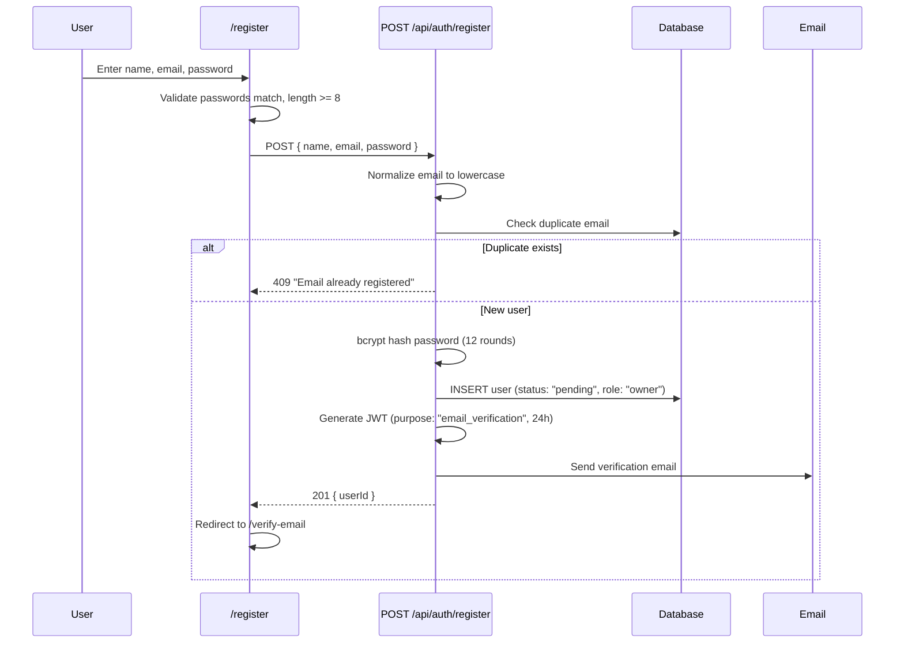

**Status:** CONFIRMED

**Gaps:**
- No rate limiting (constants defined but unused)
- No CAPTCHA/bot protection
- `confirmPassword` not validated server-side
- `role` hardcoded to `"owner"` — no staff registration

---

### 1.2 Email Verification

**Files:** `src/app/(public)/verify-email/page.tsx`, `src/app/api/auth/verify-email/route.ts`, `src/app/api/auth/resend-verification/route.ts`

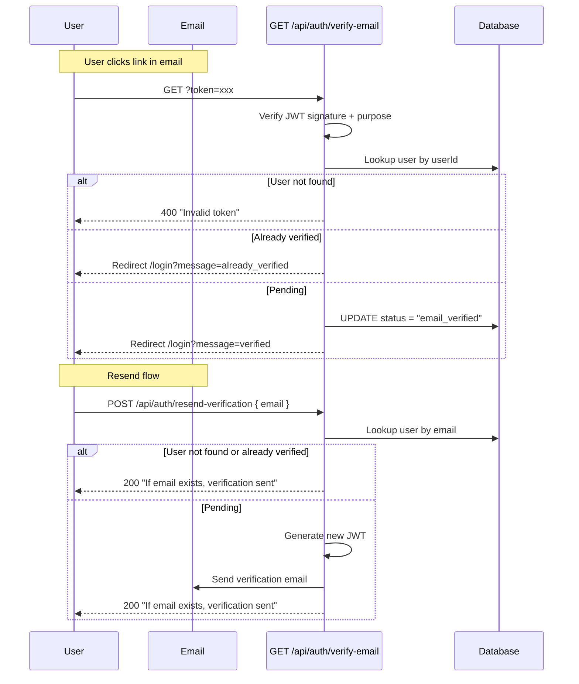

**Status:** CONFIRMED

**Gaps:**
- No check on `user.status` before resend (always returns same message)
- JWT not invalidated after use (can be reused within 24h window)

---

### 1.3 Login (Email/Password)

**Files:** `src/app/(public)/login/page.tsx`, `src/lib/auth/config.ts`

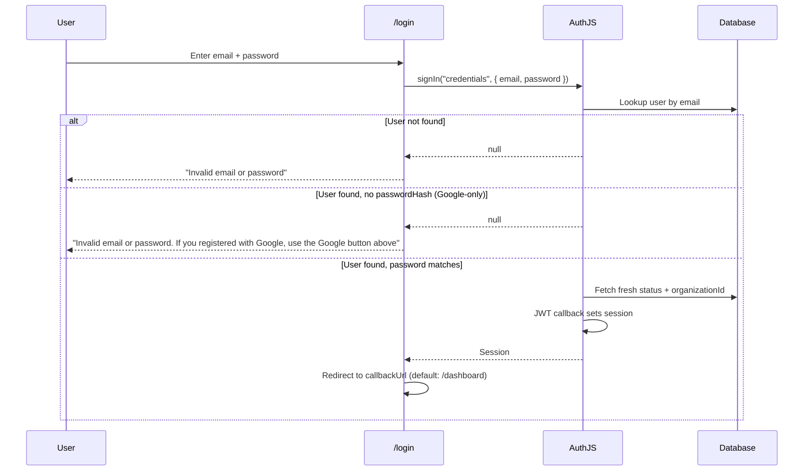

**Status:** CONFIRMED

**Gaps:**
- Google login always redirects to `/onboarding` (middleware redirects if already active — functional but roundabout)

---

### 1.4 Google OAuth Login

**Files:** `src/app/(public)/login/page.tsx`, `src/lib/auth/config.ts`

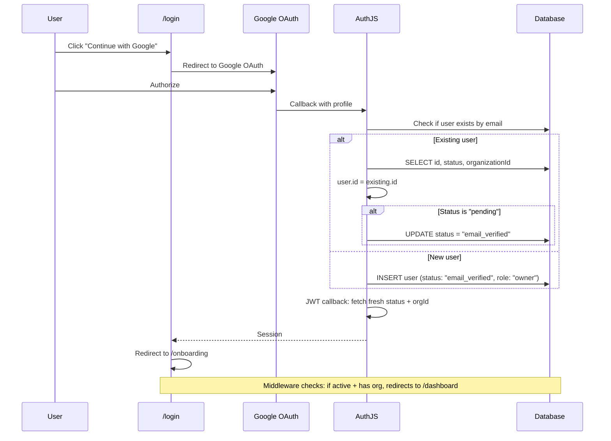

**Status:** CONFIRMED

**Gaps:**
- Google users always land on `/onboarding` even if already onboarded (middleware handles redirect)

---

### 1.5 Password Reset

**Files:** `src/app/(public)/forgot-password/page.tsx`, `src/app/(public)/reset-password/page.tsx`, `src/app/api/auth/forgot-password/route.ts`, `src/app/api/auth/reset-password/route.ts`

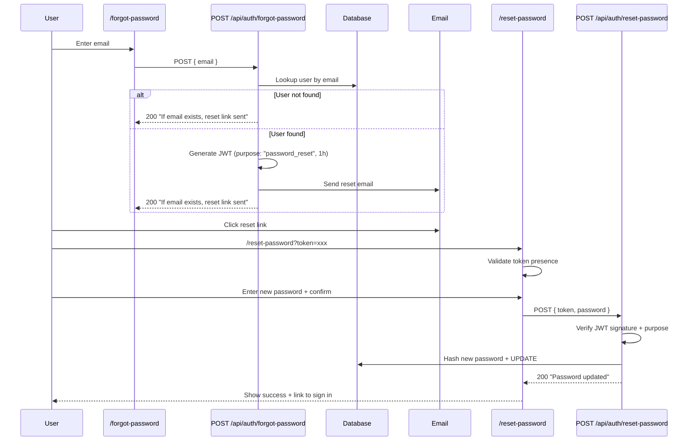

**Status:** CONFIRMED

**Gaps:**
- Token not invalidated after use (can be reused within 1h)
- No server-side password confirmation check

---

### 1.6 Onboarding

**Files:** `src/app/(auth)/onboarding/page.tsx`, `src/app/api/onboarding/complete/route.ts`

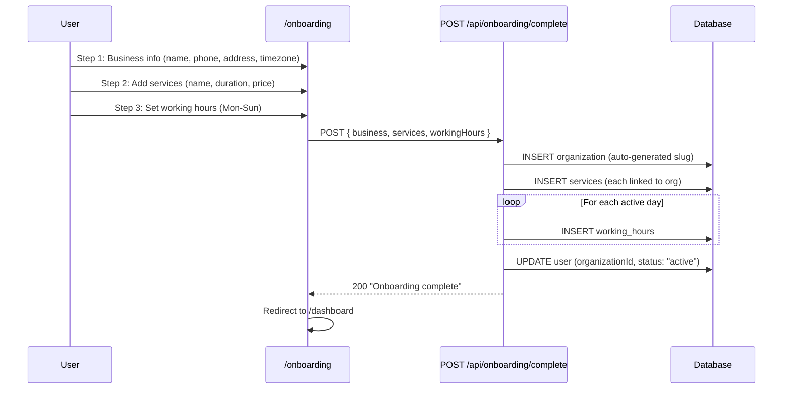

**Status:** CONFIRMED

**Gaps:**
- `business.currency` field never collected — always defaults to `"USD"`
- Services created without `bufferMinutes`, `depositRequired`, `depositAmountCents`
- Inactive days have no DB entry (correct but inconsistent with settings page behavior)

---

### 1.7 Customer Booking via Widget

**Files:** `src/app/(public)/widget/page.tsx`, `src/app/api/widget/services/route.ts`, `src/app/api/availability/route.ts`, `src/app/api/bookings/route.ts`, `src/lib/services/booking.service.ts`

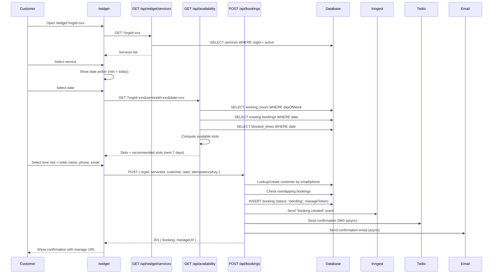

**Status:** CONFIRMED

**Critical Issues:**
- Widget shows "Booking Confirmed" but status is `"pending"`
- Manage URL (`/bookings/manage/[token]`) is a dead link — no page exists
- No slot locking — race condition possible (409 returned if double-booked)
- No auto-confirmation step — bookings stay `"pending"` forever

---

### 1.8 Dashboard Overview

**Files:** `src/app/(auth)/dashboard/page.tsx`, `src/app/api/dashboard/stats/route.ts`, `src/app/api/dashboard/today-bookings/route.ts`

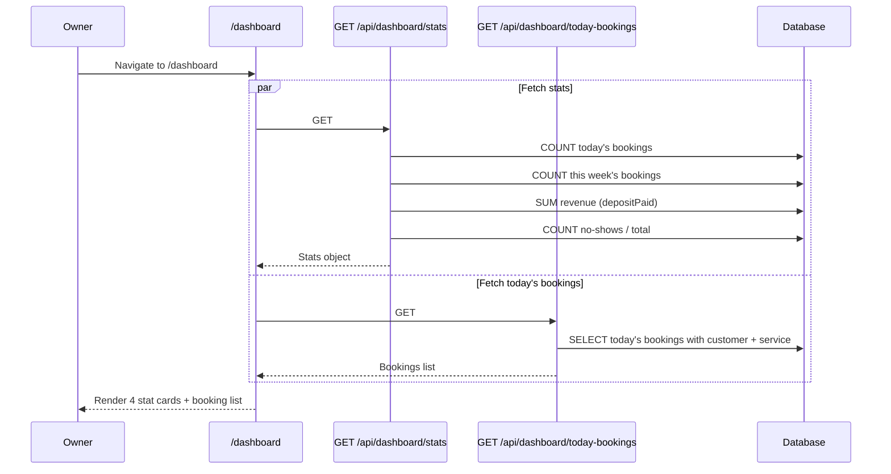

**Status:** CONFIRMED

**Critical Issue:**
- Revenue stat sums `depositPaid` (boolean 0/1) not actual dollar amounts — **bug**

---

### 1.9 Service Management (CRUD)

**Files:** `src/app/(auth)/services/page.tsx`, `src/components/services/service-modal.tsx`, `src/app/api/services/route.ts`, `src/app/api/services/[id]/route.ts`

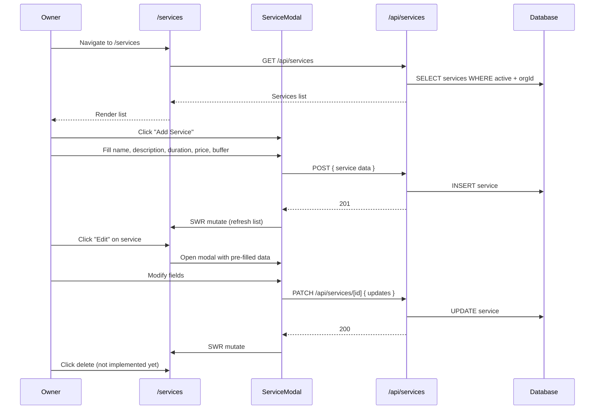

**Status:** CONFIRMED

**Gaps:**
- No delete button in UI (API supports soft delete)
- No `depositRequired` / `depositAmountCents` fields in modal
- No drag-and-drop reordering

---

### 1.10 Booking Management (Dashboard)

**Files:** `src/app/(auth)/bookings/page.tsx`, `src/app/api/bookings/route.ts`, `src/app/api/bookings/[id]/cancel/route.ts`

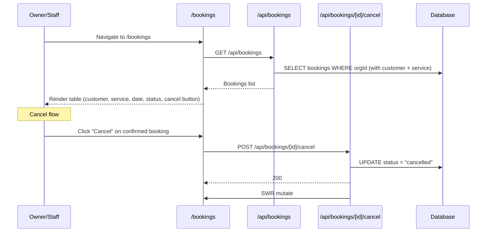

**Status:** CONFIRMED

**Critical Issues:**
- Cancel button only shows for `"confirmed"` status — but bookings are created as `"pending"` and never confirmed
- Cancel endpoint does NOT check the 2-hour cancellation window (bypasses `cancelBooking` service)
- Calendar view is placeholder ("coming soon")

---

### 1.11 Staff Management (Partial)

**Files:** `src/app/(auth)/staff/page.tsx`, `src/app/api/staff/route.ts`, `src/app/api/staff/[id]/route.ts`

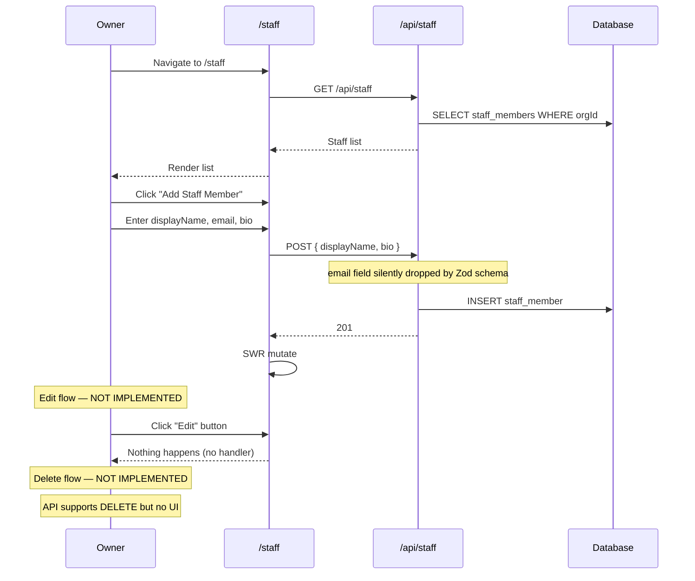

**Status:** CONFIRMED

**Critical Issues:**
- Staff email field silently dropped by API Zod schema
- Edit button has no click handler
- Delete not implemented in UI

---

### 1.12 Customer List

**Files:** `src/app/(auth)/customers/page.tsx`, `src/app/api/customers/route.ts`

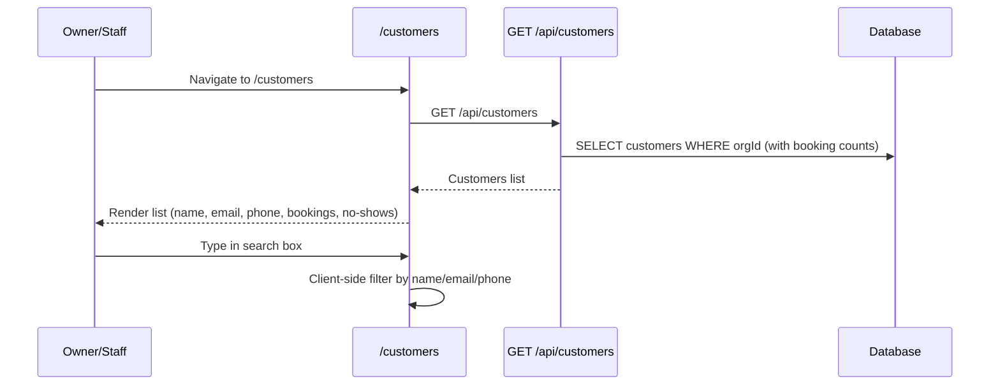

**Status:** CONFIRMED

**Gaps:**
- Read-only — no edit, delete, or detail view
- Client-side search — no pagination
- No customer detail page

---

### 1.13 Settings (Business Info Only)

**Files:** `src/app/(auth)/settings/page.tsx`, `src/app/api/settings/route.ts`, `src/app/api/settings/hours/route.ts`

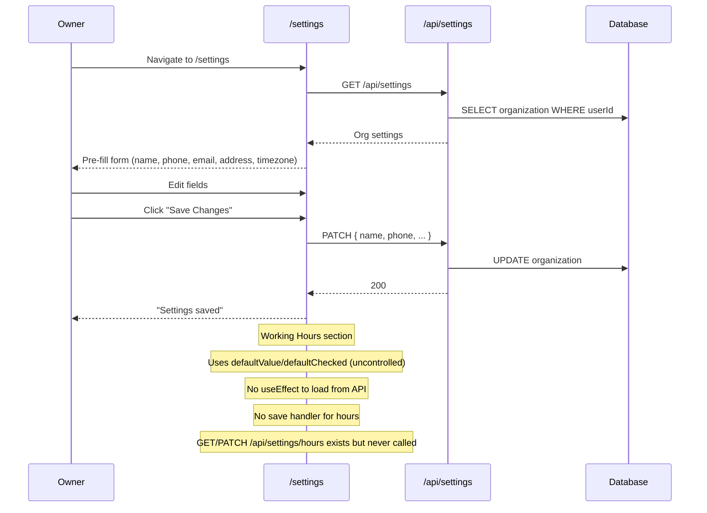

**Status:** CONFIRMED

**Critical Issue:**
- Working hours section is completely non-functional — UI renders but never loads or saves

---

### 1.14 Billing (Visual Only)

**Files:** `src/app/(auth)/billing/page.tsx`, `src/app/api/billing/route.ts`, `src/app/api/webhooks/paystack/route.ts`

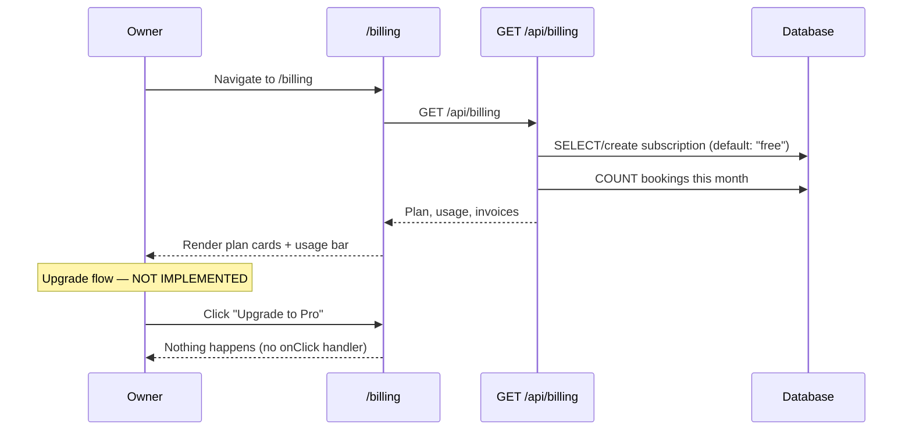

**Status:** CONFIRMED

**Critical Issues:**
- Upgrade buttons have no click handlers
- `PaystackProvider` class implemented but never instantiated
- Webhook signature verification not implemented (security risk)
- Plan limits defined but never enforced

---

### 1.15 Booking Reminder (Inngest)

**Files:** `src/lib/jobs/inngest.ts`

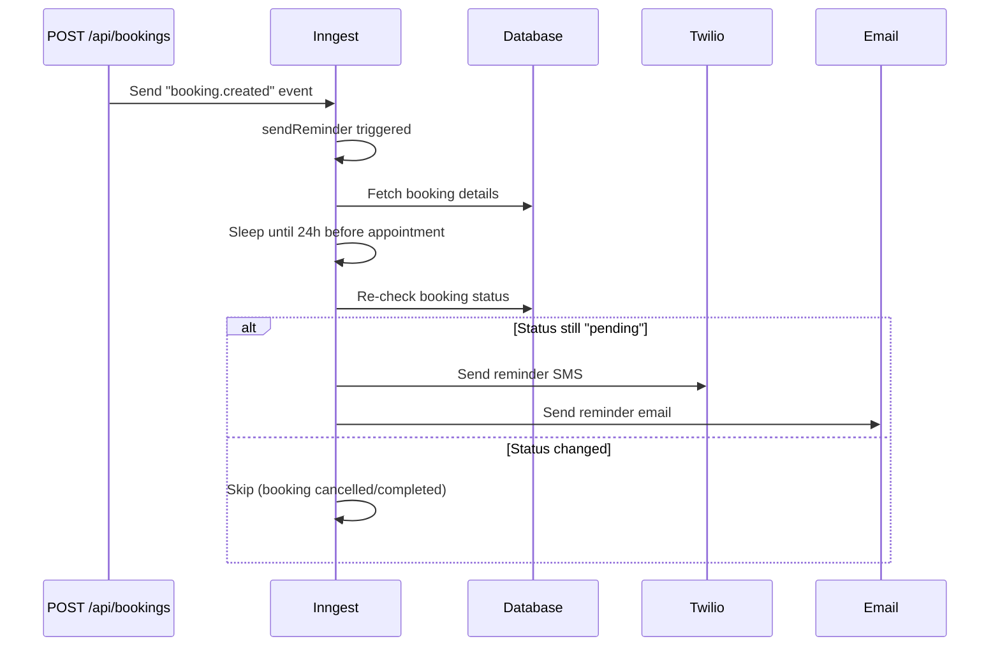

**Status:** CONFIRMED

**Gaps:**
- Only fires for `"pending"` bookings (correct since no confirmation flow exists)
- `REMINDER_HOURS_BEFORE` is 24 but message always says "24 hours"

---

### 1.16 Auto No-Show Detection (Inngest)

**Files:** `src/lib/jobs/inngest.ts`, `src/lib/services/booking.service.ts`

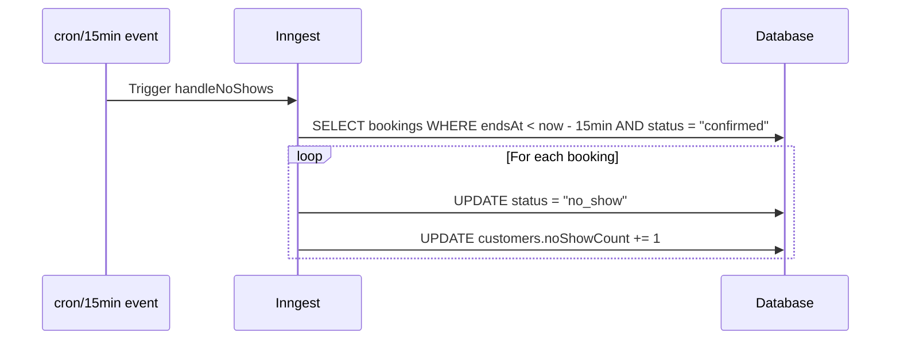

**Status:** CONFIRMED

**Critical Issue:**
- Only targets `"confirmed"` bookings — but bookings are never confirmed, so this job **never fires**

---

### 1.17 Middleware Route Protection

**Files:** `src/middleware.ts`

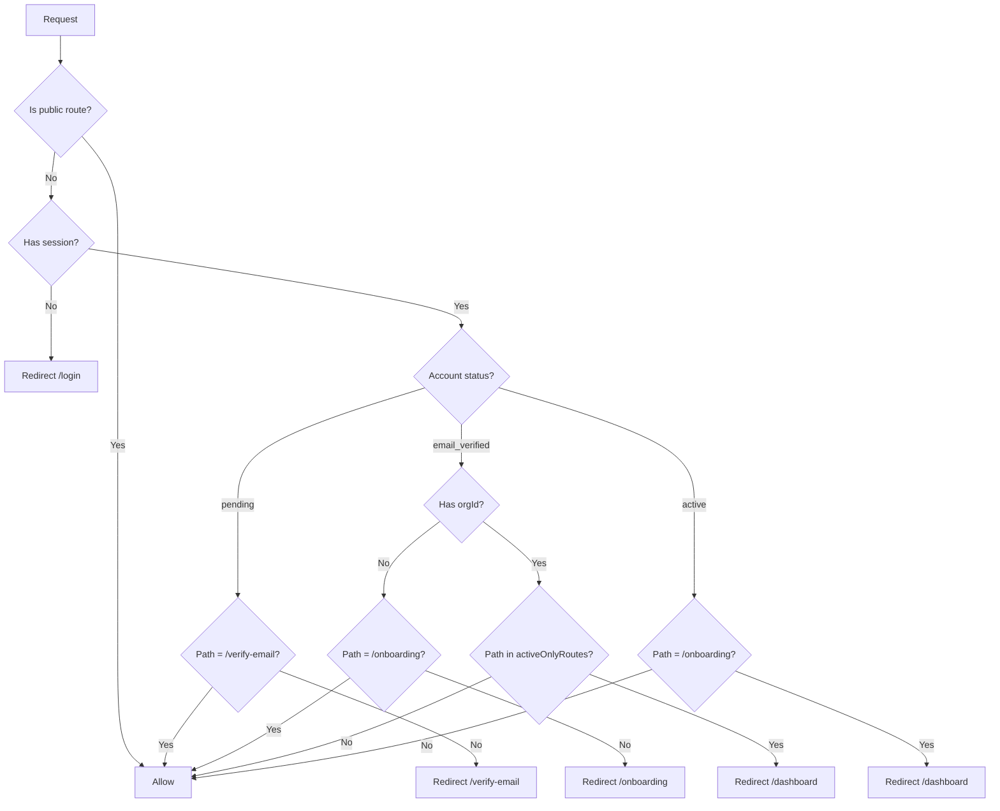

**Status:** CONFIRMED

**Gaps:**
- Middleware only protects page routes — API routes handle auth internally
- `/api/bookings` and `/api/availability` are entirely unauthenticated

---

## 2. Inferred Workflows

| Workflow | Evidence | Inference |
|----------|----------|-----------|
| Staff login | `users.role` enum includes `"staff"`, `requireStaff()` exists | Staff members can log in — but no user accounts are created for staff, so this path is unimplemented |
| Service assignment to staff | `staff_services` junction table in schema | Owner can assign staff to specific services — but no UI or API uses this |
| Staff-specific working hours | `workingHours.staffMemberId` column in schema | Staff can have custom hours — but no UI exposes this |
| Blocked time management | `blocked_times` table + availability check | Owner can block time slots — but no UI to create/manage blocked times |
| Waitlist | `waitlist_entries` table in schema | Customers can join a waitlist when slots are full — completely unimplemented |
| Audit logging | `audit_logs` table in schema | System logs admin actions — completely unimplemented |
| SMS phone verification | `generateOtp()`, `sendOtp()` in sms/index.ts | Phone numbers can be verified via OTP — functions exist but never called |
| Customer self-service | `manageToken` on bookings, `/api/bookings/manage/[token]` | Customers can view/cancel their bookings — API exists but no page renders |
| Subscription upgrade | Paystack integration, billing API, webhook handler | Users can upgrade plans — code exists but buttons have no handlers |
| Calendar view | Toggle button in bookings page | List/calendar view switching — calendar shows "coming soon" placeholder |

---

## 3. Unknown Workflows

| Workflow | What We Can't Determine |
|----------|------------------------|
| Staff invitation email | Does the system send staff an invite email when added? Code doesn't show it |
| Subscription downgrade | Can users downgrade from Pro to Free? No code exists for this |
| Subscription cancellation | Can users cancel their subscription? No code exists for this |
| Data export | Can users export their data? No code exists for this |
| Account deletion | Can users delete their account? No code exists for this |
| Super admin panel | What can super_admins do beyond owner permissions? No super_admin UI exists |
| Notification preferences | Can users configure which notifications they receive? No settings exist |
| Working hours exceptions | Can users set holiday hours or one-off overrides? No code exists for this |
| Multi-location support | Can one business have multiple locations? Schema suggests single location |
| Custom branding | Can white-label users customize widget appearance? No code exists for this |

---

## 4. Contradictions

| # | Description | Detail |
|---|-------------|--------|
| 1 | Widget says "Booking Confirmed" but status is `"pending"` | Widget confirmation step displays "Booking Confirmed!" but `createBooking()` sets `status: "pending"` |
| 2 | Cancel only for "confirmed" but bookings are never confirmed | Cancel button checks `b.status === "confirmed"` but no confirmation flow exists |
| 3 | No-show detection targets "confirmed" but bookings are never confirmed | `handleNoShows` only processes `BOOKING_STATUS.CONFIRMED` bookings |
| 4 | Settings renders working hours but never loads or saves them | Hours section uses `defaultValue`/`defaultChecked` with no API integration |
| 5 | Manage URL provided to customer is a dead route | Widget shows `/bookings/manage/[token]` but no page file exists |
| 6 | Billing shows "Upgrade" buttons that do nothing | Button has no `onClick` handler |
| 7 | Staff form has email field but API schema drops it | Form sends `{ displayName, bio, email }` but API only accepts `{ displayName, bio, avatarUrl }` |
| 8 | Pricing page mentions limits but they're never enforced | `PLAN_LIMITS` defines max services/bookings/staff but no code checks them |
| 9 | `onboarding-banner.tsx` never shows | Returns null if status is `email_verified` OR `active` — meaning it never renders |

---

## 5. Dead / Unused Code

| Item | Location | Issue |
|------|----------|-------|
| `completeBooking()` | `src/lib/services/booking.service.ts` | Exported, never called |
| `markNoShow()` | `src/lib/services/booking.service.ts` | Exported, never called by API or job |
| `PaystackProvider` class | `src/lib/payments/index.ts` | Implemented, never instantiated |
| `generateOtp()` | `src/lib/sms/index.ts` | Exported, never called |
| `sendOtp()` | `src/lib/sms/index.ts` | Exported, never called |
| `resolveOrgFromPhone()` | `src/lib/auth/tenant.ts` | Returns null with TODO |
| `resolveWidgetOrgId()` | `src/lib/auth/tenant.ts` | Never called |
| `requireActive()` | `src/lib/auth/tenant.ts` | Exported, never called |
| `slugify()` | `src/lib/utils/index.ts` | Never imported (onboarding uses own logic) |
| `formatPrice()` | `src/lib/utils/index.ts` | Never imported (pages define own) |
| `formatDuration()` | `src/lib/utils/index.ts` | Never imported (pages define own) |
| `generateShortCode()` | `src/lib/utils/index.ts` | Never imported |
| `timeStringToMinutes()` | `src/lib/utils/index.ts` | Never imported |
| `minutesToTimeString()` | `src/lib/utils/index.ts` | Never imported |
| `RATE_LIMIT` constants | `src/lib/constants.ts` | Defined, never used |
| `OTP_LENGTH`, `OTP_EXPIRY_MINUTES`, `OTP_MAX_ATTEMPTS` | `src/lib/constants.ts` | Only used in dead functions |
| `waitlistEntries` schema | `src/lib/db/schema/` | Table exists, never used |
| `auditLogs` schema | `src/lib/db/schema/` | Table exists, never used |
| `staffServices` schema | `src/lib/db/schema/` | Table exists, never used |
| `blockedTimes` schema | `src/lib/db/schema/` | Used in availability but no UI to manage |
| Calendar view | `src/app/(auth)/bookings/page.tsx` | Placeholder "coming soon" |
| Staff edit button | `src/app/(auth)/staff/page.tsx` | Button exists, no handler |
| `bookingComplete` state | `src/app/(public)/widget/page.tsx` | Redundant with `step === "confirm"` |

---

## 6. Unclear Architecture

| Area | Issue |
|------|-------|
| **Booking status lifecycle** | Bookings are created as `"pending"` but nothing confirms them. The dashboard, no-show detection, and reminders all depend on status transitions that never happen. The intended flow is unclear. |
| **Working hours source of truth** | Onboarding writes to DB, settings page can't read/write. Which page is the source of truth? |
| **Staff login path** | Staff members are records in `staff_members` but don't have user accounts. Can staff log in? The middleware and auth system support it but the data model doesn't. |
| **Payment flow** | Paystack is integrated but no payment initiation exists. Is payment supposed to happen during onboarding? After? Via webhook? |
| **Plan enforcement** | Limits are defined but never checked. Is this intentional for MVP or a gap? |
| **Widget vs embedded widget** | The widget exists as a standalone page (`/widget?orgId=xxx`). Is it meant to be embedded as an iframe? If so, how? |
| **Multi-tenancy isolation** | Some API routes check `orgId` from session, others from request body. Is this intentional? |
| **Middleware vs handler auth** | Some routes are middleware-protected, others rely on handler-level auth. Is this a pattern or inconsistency? |
| **Inngest cron setup** | `cron/15min` event is referenced but no Inngest function is configured to send it. How does the no-show job get triggered? |

---

## 7. Questions

1. **Booking status flow:** What is the intended lifecycle? Should bookings auto-confirm? Should owners manually confirm from the dashboard?
2. **Working hours:** Should the settings page load and save working hours? Or is the onboarding-only approach intentional?
3. **Staff login:** Should staff members get user accounts with login credentials? Or are they just display records?
4. **Payment flow:** When/how does the user pay? Should the upgrade button open a Paystack checkout? Or is payment handled externally?
5. **Plan limits:** Should the system enforce limits (block creating >50 bookings on free) or is this for later?
6. **Widget embedding:** How is the widget embedded on customer websites? iframe? React component? Script tag?
7. **Calendar view:** Is the bookings calendar view planned for MVP or post-MVP?
8. **Customer self-service:** Should the manage token page exist for customers to cancel/view bookings?
9. **SMS verification:** Is phone verification planned? The OTP functions exist but are unused.
10. **Super admin:** What can super_admins do? Is there a separate admin panel?

---

## 8. Summary

### What the Application Does

Bookilot is a multi-tenant SaaS booking platform for local service businesses. Business owners register, create services with durations/prices, set working hours, and receive bookings from customers via a public widget. The system handles customer information, booking scheduling, and sends email/SMS confirmations and reminders via background jobs.

### Major Architectural Components

| Component | Technology | Purpose |
|-----------|-----------|---------|
| Frontend | Next.js 15, React 19, Tailwind CSS | All pages, widgets, forms |
| API Layer | Next.js Route Handlers | 15+ API route groups |
| Auth | AuthJS v5 (JWT) | Email/password + Google OAuth |
| Database | Neon PostgreSQL, Drizzle ORM | 14 tables, multi-tenant |
| Background Jobs | Inngest v3 | Booking reminders, no-show detection |
| SMS | Twilio | Booking confirmations, reminders |
| Email | Nodemailer (Gmail SMTP) | Verification, confirmations, reminders |
| Payments | Paystack | Subscription billing (non-functional) |

### Most Important Data Flows

1. **Registration → Verification → Onboarding → Active:** 4-step lifecycle with status transitions
2. **Customer Booking → DB → Notifications → Reminders:** End-to-end booking pipeline
3. **Widget → Availability → Booking:** Public booking flow with real-time slot computation
4. **Dashboard → Stats → Revenue:** Business intelligence (partially broken)
5. **Inngest → Sleep → SMS/Email:** Background reminder system

### Most Important User Flows

1. Registration + email verification + onboarding
2. Login (credentials + Google)
3. Customer booking via widget
4. Dashboard overview
5. Service CRUD
6. Booking list + cancel

### External Dependencies

| Service | Purpose | Status |
|---------|---------|--------|
| Neon PostgreSQL | Database hosting | Connected |
| Gmail SMTP | Transactional email | Working |
| Twilio | SMS messaging | Working |
| Inngest | Background job processing | Working |
| Paystack | Payment processing | Non-functional |
| Google OAuth | Social login | Working |

### Most Important Database Entities

1. `organizations` — Tenant root (multi-tenancy boundary)
2. `users` — Auth accounts with roles + status
3. `services` — Bookable services with duration/price
4. `bookings` — Core booking records with status lifecycle
5. `customers` — Customer records with no-show tracking
6. `working_hours` — Business availability schedule
7. `staff_members` — Staff display records (no auth)
8. `subscriptions` — Billing plan tracking

### Most Important Asynchronous Processes

1. **Booking reminders:** 24h before appointment, sends SMS + email
2. **No-show detection:** 15min after appointment, marks booking as no-show
3. **Email sending:** Verification, confirmations, reminders (all async)

### Biggest Areas of Uncertainty

1. **Booking status lifecycle:** How do bookings transition from pending to confirmed?
2. **Payment integration:** How/when does payment happen?
3. **Staff authentication:** Can staff log in?
4. **Widget embedding:** How is the widget deployed to customer sites?
5. **Plan enforcement:** Are limits enforced or aspirational?

### 10 Things I'm Most Confident I Understand

1. Registration creates a user with `"pending"` status and sends verification email
2. Email verification updates status to `"email_verified"`
3. Onboarding creates org + services + hours and sets status to `"active"`
4. Google OAuth handles both new and existing users
5. Middleware enforces status-based routing
6. Widget fetches services and availability in real-time
7. Bookings are created with `"pending"` status and a manage token
8. Inngest sends 24h reminders via SMS + email
9. Service CRUD is fully functional (create, read, soft-delete)
10. Settings business info saves correctly to DB

### 10 Things I'm Least Confident I Understand

1. What happens after a booking is created — is there a confirmation step?
2. How the billing/upgrade flow is supposed to work end-to-end
3. Whether staff members can or should log in
4. How the widget is embedded on customer websites
5. Whether plan limits are enforced or just defined
6. How the no-show detection job gets triggered (cron/15min event source)
7. Whether the manage token page is planned or abandoned
8. How working hours are supposed to be edited after onboarding
9. What the `waitlist_entries` and `audit_logs` tables are for
10. Whether the revenue dashboard stat is a known bug or intentional
